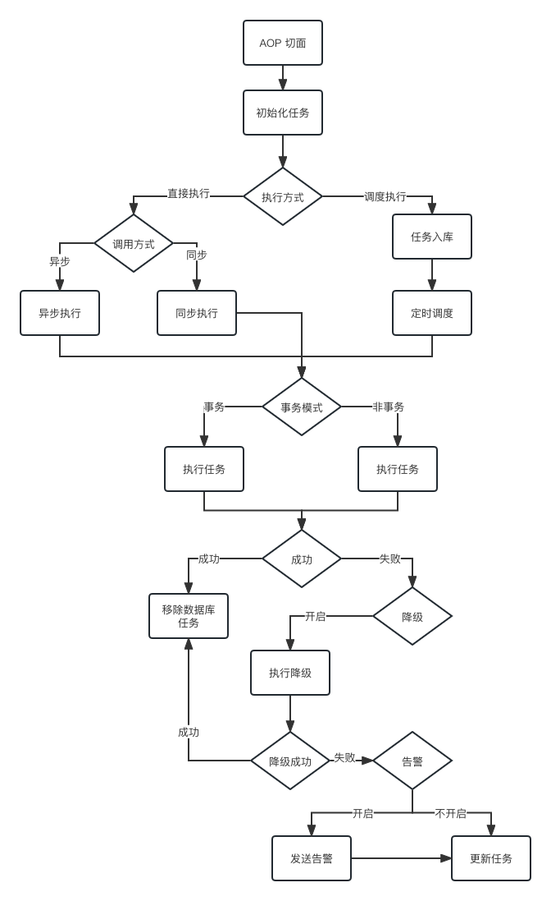

# consistency-framework 

## 介绍
最终一致性框架，保证任务最后一定能执行。

## 核心功能
* 同步/异步执行
* 固定时间/间隔时间任务调度执行
* 超时/失败告警
* ......

## 执行流程


## 快速使用

### core包到本地和远程仓库

### 引入包
```xml
<dependency>
    <groupId>cn.lifesmile</groupId>
    <artifactId>consistency-core</artifactId>
    <version>1.0-SNAPSHOT</version>
</dependency>
```

### 执行db文件夹的SQL

### 项目配置文件添加配置
```yaml
spring:
  datasource:
    url: jdbc:mysql://localhost:3306/consistency-task?characterEncoding=utf8&characterSetResults=utf8&autoReconnect=true&failOverReadOnly=false&useSSL=false
    username: root
    password: root
    driver-class-name: com.mysql.cj.jdbc.Driver
    hikari:
      connection-timeout: 3000

# 最终一致性配置
consistency:
  task:
    parallel:
      pool:
        thread-max-pool-size: 6
        thread-core-pool-size: 6
        thread-pool-keep-alive-time: 60
        thread-pool-keep-alive-time-unit: SECONDS
        thread-pool-queue-size: 200
        # 框架自身有默认的实现类 来扫描查询任务的开始时间以及结束时间架自身有默认的实现类
        #来扫描查询任务的开始时间以及结束时间，这里给出定制化的实现类，这里给出定制化的实现类
        #task-schedule-time-range-class-name:xxx.xxx.MyTaskTimeRangeQuery
    action:
      fail-count-threshold: 0
    shard:
      task-sharded: false
```

### 启动类上开启框架
```yaml
@EnableConsistencyTask
public class App {

}
```

### 一致性任务添加
```yaml
@ConsistencyTask(executeIntervalSec = 20,
        delayTime = 10, // 这个方法被调用开始，到后续被异步调度执行，至少距离调用时间已经过去了10s
        performanceWay = PerformanceEnum.PERFORMANCE_SCHEDULE,
        threadWay = ThreadWayEnum.ASYNC,
        fallbackClass = SendMessageFallbackHandler.class,
        alertActionBeanName = "normalAlerter")
// 调用的时候先进AOP切面，肯定会基于方法和注解，封装任务实例，数据会持久化落库
// 通过调度模式来进行运行，把这个持久化的任务实例从数据库里拿出来
// 还必须延迟10s再运行，运行的时候，是异步化来运行的
public void send(OrderInfoDTO orderInfo) { // SendMessageComponent.send(OrderInfoDTO)
    System.out.println(1 / 0); // 模拟失败
    log.info("[异步调度任务测试] 执行send(OrderInfoDTO)方法 {}", JSONUtil.toJsonStr(orderInfo));
}
```